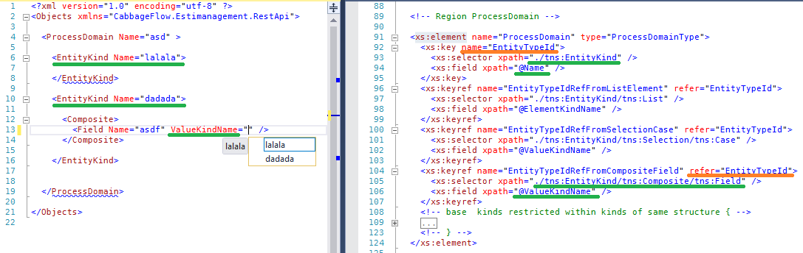

# XmlKeyRefCompletion
Experimental VisualStudio extension for Xml autocompletion based on keyref constraints from Xsd Schema

_If somebody interested in this project, create an issue please, and i'll adjust my priorities to improve it as soon as possible!_

 
_Warning: This extension uses private SchemaCache API of the builtin Xml Editor of Visual Studio for now, so keep in mind possible issues with compatibility._

